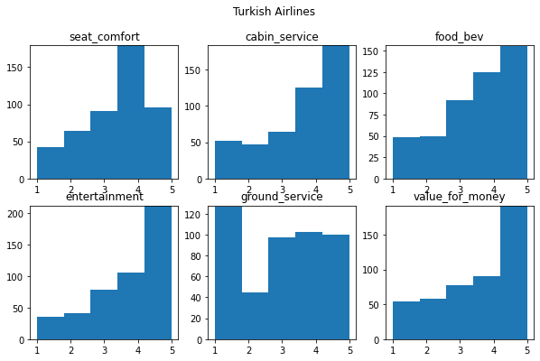
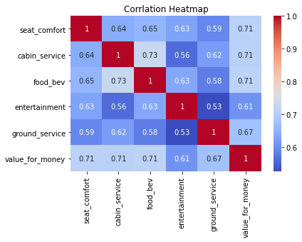
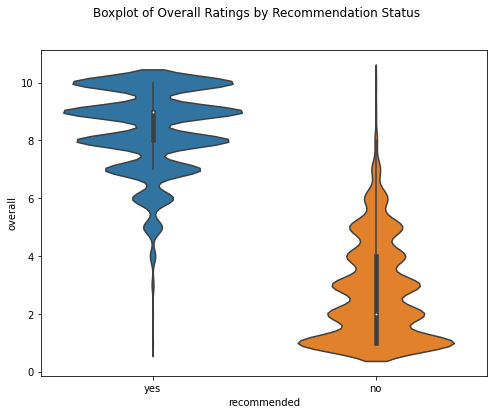

# 4400_FlightReview_NLP

## Title: Air Travel Satisfaction Prediction With Natural Language Process Project 
## Group Members: Wenting Yue, Xiaofei Xie, Yuxi Shen

## Abstract:
In this project, we aimed to predict the overall rating of airline flights based on a dataset containing both numerical features, as well as text reviews from customers. The dataset includes features such as airline, author, review date, customer review, aircraft, traveler type, cabin, route, date flown, seat comfort, cabin service, food and beverage quality, entertainment, ground service, value for money, and a recommended binary indicator. We explored three machine learning models, Decision Tree, Random Forest, and Natural Language Processing (NLP) models, and preprocessed the data by encoding categorical variables, scaling numerical variables, and tokenizing, stemming, or lemmatizing the text data.
We evaluated the performance of models using a confusion matrix, mean squared error (MSE), and accuracy. We also examined the importance of each feature in the dataset to gain insights into which factors most strongly influence customers' overall rating of flights. Ultimately, we identified the best-performing model for predicting the overall rating of airline flights based on both numerical features and text reviews.

## Documentation:

### Introduction  
**What is the problem?**   
In this project, we aim to develop a predictive model to determine whether airline passengers will recommend their trip based on the quality of service they received during their air travel. The motivation behind this project is to help leading airline companies understand the priorities of their passengers, enabling them to optimize their resources and efforts in improving the service quality. Additionally, this model will provide insights into the cognitive processes of passengers as they decide whether to recommend the airline to others.

**Why it is interesting?**  
This problem is interesting because understanding passenger satisfaction and their likelihood to recommend the airline is crucial for companies to maintain their competitive advantage in the industry. By identifying the key factors that influence passengers' recommendations, airlines can enhance their service offerings and create a more enjoyable flying experience for their passengers. This, in turn, can lead to increased customer loyalty, positive word-of-mouth, and higher profitability for the airline companies. The use cases for this problem can be found in the strategic decision-making processes of airlines, crew training and development, and resource allocation for various in-flight services.

Our model seeks to answer several important questions: What aspects do senior passengers care about most? What expectations do loyal customers have during their air journeys? What are the bearable delay time boundaries for different passengers? And, which three features are the most important predictors of passengers' likelihood to recommend the airline in general? By addressing these questions, our project aims to provide valuable insights for airline companies to cater to the diverse needs and preferences of their passengers, ensuring a better flying experience for all. Ultimately, this study will contribute to the ongoing efforts of airlines to improve customer satisfaction, enhance brand loyalty, and maintain a strong competitive position in the market, as well as increase the likelihood of passengers recommending their services to others.

**What is the approach you propose to tackle the problem?**  
To tackle the problem of predicting whether a customer will recommend a trip based on the quality of service they received, we propose a two-step approach. First, we will apply a natural language processing (NLP) algorithm to analyze the passengers' reviews, extracting valuable insights on their sentiment towards the airline's services. For this purpose, we will use PyTorch to set up our own sentiment analysis model, which will be trained on the current dataset we have. Then, we will apply the outcomes of the sentiment analysis to a decision tree model to make predictions on passengers' likelihood to recommend the airline.

This approach makes sense for the problem as NLP can effectively process and analyze unstructured text data, such as reviews, and identify patterns related to passengers' opinions and preferences. The decision tree model, on the other hand, can handle both categorical and numerical data, making it suitable for this task. It is also easy to interpret and can provide insights into the relative importance of different factors affecting passengers' recommendations.

**Why is the approach a good approach compared with other competing methods?**  
The proposed approach, combining NLP for sentiment analysis and a decision tree model for prediction, is a good approach compared to other competing methods. NLP has proven to be an effective method for sentiment analysis, as it can capture the nuances and complexities of human language. The decision tree model is a suitable choice for this problem because it can handle a mix of categorical and numerical data, and it offers a high degree of interpretability, which is beneficial when understanding the key factors influencing passengers' recommendations.

Our approach differs from the reference (https://github.com/bentrevett/pytorch-sentiment-analysis) in that we use categorical data as our target variable (whether the passenger will recommend the airline or not), while the reference uses numerical data as the target variable (sentiment scores). This difference allows our approach to focus more on the binary outcome of recommendations rather than a continuous range of sentiment scores.

**What are the key components of my approach and results? Also, include any specific limitations.**  
The key components of our approach include the application of NLP algorithms for sentiment analysis using PyTorch and the implementation of a decision tree model for predicting passengers' likelihood to recommend the airline. Our approach offers valuable insights into passengers' opinions and preferences, as well as the factors that drive their decision to recommend the airline to others.

However, our approach has some limitations. For instance, the performance of the sentiment analysis model depends on the quality and representativeness of the dataset used for training. Additionally, the decision tree model, while interpretable, might be prone to overfitting, especially when dealing with complex relationships between various factors. To address the limitations, we have utilized a random forest model, an ensemble learning technique that combines multiple decision trees, enhancing prediction accuracy and robustness. This approach mitigates overfitting and improves the prediction of passengers' recommendations.


### Setup:

**Dataset Description**  
Our dataset was gathered from the file capston_airlin_review3.csv, and we found this dataset on Kaggle. This original dataset includes airline reviews from 2006 to 20199 for popular airlines around the world with multiple choices and free test questions. This dataset contains 17 features, including 'airline', 'overall', 'author', 'review_date',' customer_review', 'aircraft', 'traveller_type', 'cabin', 'route', 'date_flown', 'seat_comfort', 'cabin_service', 'food_bev', 'entertainment', 'ground_service', 'value_for_money', 'recommended'. We added another field called "sentiment" to hold sentiment scores for each line of customer review. This flight customer review dataset contains 14211 rows of data after we dropped all the NaN values. Since this dataset contains a few categorical features and a rich text field as well, we decide to implement both Decision Tree Classifier model and Natural Language Process model to make predictions and evaluate the prediction accuracy. 

Feature descriptions are provided as follows:  
airline: Name of the airline  
overall: Overall point given to the trip between 1 to 10  
author: Author of the trip  
review_date: Date of the Review  
customer_review: Review of the customers in free text format  
aircraft: Type of the aircraft  
traveller_type: Type of traveller (e.g. business, leisure)  
cabin: Cabin at the flight  
date_flown: Flight date  
seat_comfort: Rated between 1-5  
cabin_service: Rated between 1-5  
food_bev: Rated between 1-5  
entertainment: Rated between 1-5  
ground_service: Rated between 1-5  
value_for_money: Rated between 1-5  
recommended: Binary, target variable  


**Data scource**  
If you want to have a look at the original dataset, please find it here on Kaggle: https://www.kaggle.com/datasets/efehandanisman/skytrax-airline-reviews

To load dataset into python:

```
import pandas as pd

df_flight = pd.read_csv("capstone_airline_reviews3.csv", encoding="utf-8", encoding_errors='ignore').dropna()
```

**Visualization for a glimpse of dataset**  

  
The histogram shows the distribution of each quantitative data for each airline. 

  
This correlation heatmap presents the correlations between six features in the flight dataset, including seat comfort score, cabin service score, food or beverage score, entertainment score, ground service score, and evaluation score of the value of money. 

  
The violin plot visually represents the distribution of overall scores (ranging from 0 to 10) for airline journeys, with the scores on the y-axis and recommendations on the x-axis, divided into two categories: "yes" and "no." 

**Decision Tree Classifier Model Setup**  
For Decision Tree Classier model, we use 'overall', 'seat_comfort', 'cabin_service', 'food_bev', 'entertainment', 'ground_service', 'value_for_money', 'sentiment' features. To train a decision tree classifier, we preprocess the dataset by encoding categorical variables into dummy variables, scaling numerical variables, and splitting the data into training and testing sets.

```
from sklearn.model_selection import train_test_split
dummy = pd.get_dummies(df_flight['airline'])
dummy_travel = pd.get_dummies(df_flight['traveller_type'])
dummy_cabin = pd.get_dummies(df_flight['cabin'])
df_flight = pd.concat([df_flight, dummy,dummy_travel,dummy_cabin], axis=1)
X = df_flight.drop(['author', 'review_date','route','recommended','aircraft','airline','customer_review','date_flown','traveller_type', 'cabin'], axis = 1)
y = df_flight['recommended']
X_train, X_test, y_train,y_test = train_test_split(X, y, test_size = 0.2, random_state = 100)

```

We use scikit-learn's DecisionTreeClassifier with default hyperparameters, and evaluate the model on the testing set using accuracy, confusion matric, and MSE score with the optimale min_sample_split value and optimal min_sample_leaf value. The aim is to predict customers response to recommend the airlines they took based on the satisfaction score of each service they enjoyed during flight. In addition, we apply Bagging approach to understand the importnace of each feature contains in the training dataset.

```
from sklearn.tree import DecisionTreeClassifier
tree= DecisionTreeClassifier()
tree.fit(X_train, y_train)
```

Moreover, we use scikit-learn's RandomForestClassifier with default hyperparameters, and evaluate the model on the testing set using accuracy and MSE with the optimal max_depth and the optimal min_samples_split. 

```
from sklearn.ensemble import RandomForestClassifier
# Train the random forest
random_forest = RandomForestClassifier(n_estimators = 100, n_jobs = -1)
random_forest.fit(X_train, y_train)
```

**Natural Language Process Model Setup**  

For NLP model, we applied the 'customer_review' and 'recommended' feature. To run the NLP model, you will first need to install torch related libraries on your local computer:  
```
pip uninstall torch torchtext -y

pip install torch==1.9.0 torchtext==0.10.0

pip install spacy

!python -m spacy download en_core_web_sm

!pip install --upgrade torchtext

```
And also import the following libraries:  
```
import pandas as pd
from textblob import TextBlob

import torch
import torch.nn as nn
import torch.optim as optim
from torchtext.legacy import data
from torchtext.legacy import datasets
from torchtext.datasets import IMDB
from sklearn.model_selection import train_test_split

import spacy
```

To build an NLP model for classifying customer reviews as positive or negative, we'll first preprocess the text data by tokenizing, removing stop words, and stemming or lemmatizing the words. Then, we'll represent the text using a numerical format such as word embeddings or bag-of-words matrix.

Next, we'll use a Recurrent Neural Network (RNN) with a Long Short-Term Memory (LSTM) or Gated Recurrent Unit (GRU) architecture to model the sequence of words in each review. The RNN will take in the numerical representation of the text and output a probability distribution over the three classes. We'll train the model on a portion of the dataset, evaluate its performance on a validation set based on the validation loss score, validation accuracy score, and sentiment score, and tune its hyperparameters to optimize performance.

In summary, our goal is to build an NLP model that can accurately classify customer reviews as recommeded or not. We'll achieve this by using a RNN to model the sequence of words in each review, and training the model using a numerical representation of the text.

*Please find detailed implementation in the nlp.ipynb file.

## Results

**Main results**

- Natural Language Process Model

The model has been trained for 3 epochs, and we can observe that the training accuracy does not improve significantly over these epochs. After the first epoch, the training accuracy is 66.23%, which increases slightly to 66.64% after the second and third epochs. The validation accuracy after the third epoch is 66.81%. These results indicate that the model might not be learning effectively from the data, as the accuracy levels are not very high and do not show significant improvement. The validation accuracy is around 66.81%.

- Decision Tree: 
The baseline Decision Tree classifier achieved an accuracy of 0.9339.

Optimized parameter: 
By tuning the max_depth parameter, the optimal max_depth was found to be 5, and the accuracy improved slightly to 0.9402.
Tuning the min_samples_split parameter led to an optimal value of 100, yielding an accuracy of 0.9363. Tuning the min_samples_leaf parameter resulted in an optimal value of 54, with an accuracy of 0.9413. The final optimal Decision Tree classifier, with all three parameters tuned, achieved an accuracy of 0.9413.

Using a Bagging Classifier with the optimal Decision Tree as the base estimator, the accuracy was 0.9409, which is comparable to the optimal Decision Tree classifier. Overall, the accuracy of the optimized decision tree is high indicating the model is well-fitted.

- Random Forest:
The experiments conducted using the RandomForestClassifier indicate that it performs better than the previous Decision Tree and Bagging Classifier models. The accuracy achieved by the RandomForestClassifier with default settings (n_estimators = 100) is 0.94899754. The optimized random forest classifier with n_estimaters and max_features has been tuned, and the accuracy can reach 0.95.  The random forest classifier model is well-fitted


**Supplementary results**

- Natural Language Process Model

The model architecture chosen for this task is a bidirectional LSTM with the following parameters:

Input dimension: Length of the TEXT vocabulary (INPUT_DIM)
Embedding dimension: 100 (EMBEDDING_DIM)
Hidden dimension: 128 (HIDDEN_DIM)
Output dimension: 1 (OUTPUT_DIM)
Number of layers: 2 (N_LAYERS)
Bidirectional: True (BIDIRECTIONAL)
Dropout: 0.5 (DROPOUT)
Padding index: Index of the padding token in TEXT vocabulary (PAD_IDX)
The optimizer chosen for training is Adam with a default learning rate, and the loss function is BCEWithLogitsLoss. The model is trained for 3 epochs, and the batch size is set to 64.

The parameter choices for the model architecture and training process seem reasonable, but the results indicate that the model might not be learning effectively from the data. This might be due to various factors such as insufficient training data, suboptimal hyperparameter choices, or the model architecture not being suitable for the task. Further experiments with different model architectures, hyperparameters, and additional training data might help in improving the performance.

- Decision Tree： 
The max_depth parameter controls the maximum depth of the tree. The chosen range is 2 to 50 The optimal value (5) helps prevent overfitting by limiting the tree's depth.

The min_samples_split parameter determines the minimum number of samples required to split an internal node. Range from 2 to 100 was explored. The optimal value (100) ensures that the tree does not become too complex.

The min_samples_leaf parameter sets the minimum number of samples required to be at a leaf node. A range of values from 1 to the number of leaves was considered. The optimal value (54) helps ensure that the tree does not create leaves with very few samples.

In conclusion, the experiments show that tuning the parameters of the Decision Tree classifier can lead to improved performance. The Bagging Classifier provides a comparable result, showing the potential of ensemble methods to further enhance classification tasks.


- Random Forest

To improve the performance of the RandomForestClassifier, the max_features and n_estimators hyperparameters were tuned. For max_features, a range of 1 to 20 was considered, and cross-validation was used to determine the optimal value. The optimal max_features value was found to be 15, resulting in an accuracy of 0.94759057.

Similarly, the n_estimators parameter was tuned using a range of 1 to 20. Cross-validation was again employed to find the optimal value. The optimal n_estimators value was found to be 20, leading to an accuracy of 0.95145973.

Finally, by combining the optimal values for both max_features and n_estimators (15 and 20, respectively), the RandomForestClassifier achieved an accuracy of 0.94970102. This indicates that the model's performance improved after tuning the hyperparameters.

## Discussion

- Natural Language Process Model

The results obtained from the experiments indicate that the model's performance is not as good as we had hoped for. There is no significant improvement in accuracy across the epochs. This suggests that the model might not be effective in learning from the data. Here are some potential issues and possible solutions we plan to implement:

Insufficient training data: In order to increase the speed in trying we limit to 500 data samples might be too small for the model to learn effectively. A larger dataset could help the model learn more complex patterns and improve its performance. We will Increase the size of the dataset by including more records or by using data augmentation techniques.

Suboptimal hyperparameter choices: The current hyperparameter choices might not be the best fit for this problem. The learning rate, number of layers, hidden dimensions, dropout rate, and other hyperparameters could be tuned to improve the model's performance. We would Perform a grid search or use Bayesian optimization to find the optimal hyperparameters for this problem.

Preprocessing and tokenization: The quality of the input data and its preprocessing can have a significant impact on the model's performance. We will investigate the data preprocessing steps and improve them if necessary. This may include better tokenization, removing irrelevant information, or using a more suitable tokenizer for the task.

## Reference: 
Our implementation uses bentrevett's [Updated Sentiment Analysis](https://github.com/bentrevett/pytorch-sentiment-analysis/blob/master/2%20-%20Upgraded%20Sentiment%20Analysis.ipynb)code as a starting point. 